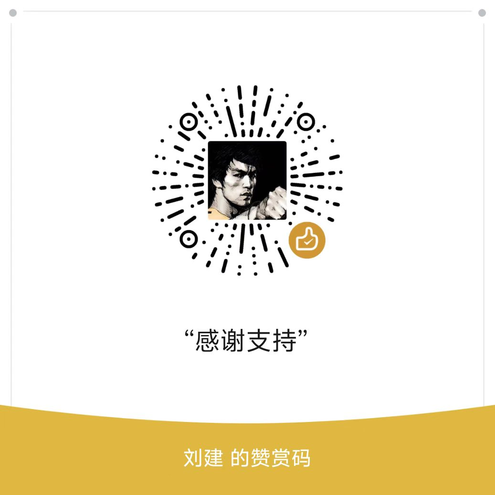

# NexPort — 安卓端统一 AI 网关（mobile-port 源码分支）

> **NexPort 基于 [ClawProxyHub](https://github.com/ShadowSmallBaby/ClawProxyHub)（AGPL-3.0）修改构建。**
> 桌面端原版见上游仓库与本仓库 `main` 分支；**安卓端完整源码就在本分支（`mobile-port`）**。
> 许可见根目录 [LICENSE](LICENSE)（AGPL-3.0 全文）与 [THIRD_PARTY_NOTICES.md](THIRD_PARTY_NOTICES.md)。

NexPort 安卓版把 ClawProxyHub 的 Go 核心（网关、路由、账号、分组、密钥、任务调度、市场）
原样搬进一部手机：应用内完成引导、启动、装插件、开临时隧道、后台保活，面板就长在
WebView 里。当前版本 **v1.4.6（versionCode 11）**。

---

## 为什么已有桌面端还要做移动端

说实在的，重度使用场景桌面端确实更合适——屏幕大、常开、操作方便，这个定位没有变。
移动端解决的是另一件事：**网关随手机走，不必为一台网关常开一台电脑。**

具体来说，安卓版在应用内一键完成这几件核心的事：

- **核心启动**：图形化引导（免责声明 → 建管理员账号 → 启动核心 → 指南），开箱即用；
  账号建档后自动配置引擎直接生成分组、路由和默认 API 密钥，不用从零开始点；
- **插件安装**：面板「插件」市场照常用，安卓上 Lua 插件可直接在线装；
- **临时隧道**：Cloudflare TryCloudflare 一键开关，出门也能把网关暴露成公网入口；
- **保活**：前台服务 + 电池优化豁免 + 开机自启（后两项默认关，由你决定）；
- **局域网访问**：核心额外绑定检测到的局域网 IP（绝不绑 0.0.0.0 通配），同一 WiFi 下
  电脑、平板可以直接把 base URL 指到手机上。

两端共享**同一个 Go 核心与同一套插件生态**：核心代码 fork 自上游并做了安卓化改造
（生命周期库化、日志改道、TMPDIR 修复等，详见下文），插件契约（gRPC/protobuf）与
上游线格式兼容——桌面上能跑的插件生态，这里基本通用。

## 为什么选择插件化

ClawProxyHub 的架构本来就是插件化的：核心只管网关、路由、账号这些通用的事，具体接入
哪家服务，由插件说了算。这个选择对我们普通用户最大的意义是——**不用被动等作者更新。**

传统一体化对接方式下，想接一个新站点只能等作者适配、发版，参与度很低。插件化把能力
开放了出来：谁都可以为自家在用的站点写一个 Lua 插件（免编译、免打包二进制，写完
打包成 `.cphplugin` 就能装）。

为了把门槛再降一档，应用已在**关于页内置了 lua-plugin-dev 开发指南**（源码位于
`app/src/main/assets/lua-dev-skill/`）：一份 `SKILL.md`、官方 autoclaw 插件完整示例、
以及一个 hello-world 最小模板。把这份技能装进你自己的 AI agent，就能让 AI 帮你写插件——
指南里所有 API 名称、字段、协议细节都取自真实源码，不是凭空编的。

写出好用的插件，欢迎分享到 QQ 群 **1124936153**，让更多人直接用上。

## 目录

```
.
├── core/      Go 核心库（io.nexport.gateway/core）——上游内核 fork＋安卓化改造
│   ├── app/         生命周期：Start/Stop/Restart（替代桌面 main.run）
│   ├── conf/  account/  adminapi/  database/  gateway/  plugmgr/  router/
│   ├── task/  setting/  event/  fingerprint/  janitor/  model/  runlog/
│   ├── logsink/   日志统一出口（安卓不可依赖 stdout）
│   ├── tunnel/    cloudflared 临时隧道（第二监听器仅 /v1 + /health）
│   ├── sdk/       插件契约（gRPC/protobuf，与上游线格式兼容）
│   ├── luahost/   Lua 插件宿主（独立 module，CGO 构建安卓 .so）
│   ├── web/       go:embed all:dist —— 面板产物占位（dist 由 build-dashboard.sh 生成）
│   ├── cmd/nexcore/  桌面冒烟入口
│   └── plugmgr/luahost.bin  Lua 宿主二进制（-tags luahost_embed 桌面构建所需）
├── bridge/    gomobile bind 包（io.nexport.gateway/bridge）
├── dashboard/ 面板源码（fork 自上游 web/，品牌 NexPort；pnpm build → core/web/dist）
├── app/       安卓壳工程（Kotlin 模块 :app）
├── android/   壳工程对接说明（模块本体在 app/）
├── tools/     构建脚本（env.sh + build-{dashboard,aar,luahost,cloudflared,android,plugins}.sh
│              + prepare-android.sh + make-source-zip.py）
├── third_party/ClawProxyHubPlugins/  内置 Go 插件的完整对应源码（AGPL §13）
│              （同源 .go 源码亦落在 core/plugmgr/builtin/<名>/，构建自包含）
├── docs/      赞赏码（reward-qr.jpg）
├── LICENSE    AGPL-3.0 全文
└── THIRD_PARTY_NOTICES.md
```

构建产物（`core/dist/`、`app/build/`、`app/src/main/jniLibs/`、`app/libs/`、
`dashboard/node_modules/` 等）不入库，全部由 `tools/` 下脚本从源码再生；签名 keystore
与机器相关配置同样不入库。`core/web/dist/.gitkeep` 仅为 go:embed 的编译占位。

## 获取与构建

### 获取安装包

- **安卓 APK**：本仓库 [Releases](https://github.com/bilieebiliee1-design/ClawProxyHub/releases) 页提供（当前 v1.4.6，附 APK/AAB 与 SHA256 校验和）；也可以按下方步骤自行构建。
- **桌面版**：上游 [ShadowSmallBaby/ClawProxyHub](https://github.com/ShadowSmallBaby/ClawProxyHub)。
- **源码**：安卓端完整源码即本分支 `mobile-port`；桌面端在 `main` 分支（上游内容）。

### 从源码构建（Windows 主机，Git Bash 实测）

前置：Go（含 gomobile/gobind）、Node + pnpm、JDK 21、Android SDK
（platforms;android-36 + build-tools;36.0.0）、NDK r29、Gradle 9.6.1。
**注意：`tools/env.sh` 与 `tools/build-android.sh` 内置的是作者本机的绝对路径**
（JDK/SDK/NDK/Gradle/go 的位置），换机器请先按文件内注释改成自己的路径。

```bash
git clone -b mobile-port https://github.com/bilieebiliee1-design/ClawProxyHub.git nexport
cd nexport
source tools/env.sh
tools/build-dashboard.sh     # ① pnpm 构建面板 → core/web/dist
tools/build-aar.sh           # ② gomobile bind → core/dist/gateway-core.aar
tools/build-luahost.sh       # ③ CGO → libluahost-android-{arm64,x64}.so
tools/build-cloudflared.sh   # ④ cloudflared-android-{arm64,x64}
tools/build-android.sh       # ⑤ prepare-android.sh 落位 + gradle 打包
```

产物落在 `app/build/outputs/apk/release/app-release.apk` 与
`app/build/outputs/bundle/release/app-release.aab`。签名：`keystore/`（本地文件，不入库）
——没有它时 release 不签名、仅 debug 可构建，自备一个即可。

桌面冒烟（验证核心本身，不需要安卓环境）：

```bash
go run ./cmd/nexcore   # env CPH_DATA_DIR=./data；curl 127.0.0.1:<port>/health
```

## 欢迎二改，但请依规

欢迎 fork、欢迎二改，这也是 AGPL-3.0 的本意。但既然拿的是别人的开源成果，请同样依规：

1. **保留 [LICENSE](LICENSE) 全文与版权声明**——不得删改、不得换协议；
2. **保留署名**——保留对上游 [ShadowSmallBaby/ClawProxyHub](https://github.com/ShadowSmallBaby/ClawProxyHub)
   与本仓库（bilieebiliee1-design/ClawProxyHub `mobile-port` 分支）的署名；
3. **同样以 AGPL-3.0 开放你修改后的完整源码**——包括分发出去的版本，以及你部署起来
   给别人用的网络服务版本（AGPL §13）；
4. **应用内「关于页」的署名不可移除**——UPSTREAM_NAME / UPSTREAM_URL 与 fork 源码链接
   是构建常量，关于页固定展示；
5. 如果这个项目对你有帮助，顺手给 [本仓库](https://github.com/bilieebiliee1-design/ClawProxyHub)
   和 [上游仓库](https://github.com/ShadowSmallBaby/ClawProxyHub) 点个 Star，是给作者最实在的鼓励。

## 赞赏

如果 NexPort 帮到了你，可以请作者喝杯咖啡：



赞赏是为了获得更多持续维护的动力——如果收获足够的鼓励，就可以一直为爱发电。赞赏后可
进群（QQ 1124936153）联系作者进入 **VIP 会员群**：相关反馈会优先满足、获得持久的技术
支持。当然，不赞赏也完全可以正常使用全部功能，提 issue 一样欢迎。

## 核心与桌面版的差异（移植改造点）

1. **生命周期库化**：`app.Start(ctx, Options) (gatewayPort, tunnelPort, err)`——
   两监听器一律 `127.0.0.1:0` 先 bind 再回报实际端口；去 signal/os.Exit；`Restart()`
   供备份恢复闭环（restore/ 换入需重启）。
2. **隧道第二监听器**：仅挂 `gw.Handler()`（/v1/* + /health）；/admin、面板、图标
   端点拓扑不可达。隧道由 `tunnel.Manager` 管理（TryCloudflare，QUIC 失败自动
   `--protocol http2` 重试一次），默认关。
3. **日志统一出口**：`logsink`（database gorm logger、gateway、plugin host/manager、
   task、janitor、sdk 等 12+ 处原 stdout/stderr 全部改道）；bridge 节流后回调 Kotlin。
4. **TMPDIR 修复**：`app.Start` 前置设 TMPDIR，且 adminapi 三处 `os.CreateTemp`
   改走显式缓存目录（市场下载/离线上传/备份导出）。
5. **secret.key 双格式**：桌面裸 32 字节（备份换入场景）与安卓 Keystore 信封
   （`NXPORT-KEY-ENVELOPE v1` 头）兼容；信封缺注入时快速失败，绝不静默重生成。
6. **插件安卓分支**：lua 经 `nativeLibraryDir/libluahost.so --dir <插件目录>` 启动
   （不写 data/hosts）；Go 插件回查 `nativeLibraryDir/libplugin_<name>.so`（仅 APK
   预打包）；市场安装仅放行 runtime=lua 包，Go 包明确拒绝（内置 Go 插件除外，
   二进制随 APK 经 nativeLibraryDir 提供）。
7. **服务端密码策略加强**：/admin/setup 要求 ≥10 位含大小写与数字（原生引导同规）。
8. **版本位**：`version.Core`（1.2.9，随上游 SDK v1.2.2 / fb6475c 移植同步）+ `version.Mobile`（1.4.3）。

<details>
<summary><strong>附：v1.3.0 核心侧改造记录（本地修订，展开阅读）</strong></summary>

> 以下五块均带单元/端到端回归（`core/app`、`core/adminapi`、`core/task`、`core/plugmgr`）。

### ① 网关端口持久化（`app/port.go` + `app/app.go`）

- **自动端口（Options.GatewayPort = 0，默认）**：首次启动随机绑定并把端口写入
  `<DataDir>/gateway.port`；之后每次启动**优先复用**该端口；仅当绑定失败（被占用等）
  才重新随机，并产生「端口变更（旧→新）」记录。持久化用文件而非 settings 表：监听器
  有意先于建库绑定（启动失败快速、不占资源），此刻 DB 尚未打开。
- **端口变更通知三通道**：`bridge.PortChangeNotice()`（Start 成功后查询一次，应用 UI
  弹提示）+ run-logs（面板运行日志页）+ 站内通知（面板铃铛）。
- **与「固定端口/自动」协同**：固定端口（1-65535）语义不变——被占用 Start 直接报错，
  不静默换口；固定端口绑定成功后同样落盘，用户切回「自动」时从最近生效端口继续。

### ② 自动配置引擎（`adminapi/autocfg.go`，开箱即用）

触发时机：账号建档成功（`POST /admin/accounts/login` 返回 `done:true`）后同步执行
（纯 DB 操作，毫秒级；模型目录已在建档时同步落库），结果随响应 `auto_config` 字段
回显，应用据此展示「本地/局域网端点 + 密钥 + 模型映射说明」。

1. **分组**：为插件的每个实例建一个分组并纳入其全部账号（同插件多账号同一分组；
   分组模型限定同实例，多实例插件按实例各建一组）。已有该插件+实例分组则复用并入。
2. **模型路由**：模型名**原样映射**——对外路由名 = 客户端请求的 model = 分组内真实
   模型 id（单分组权重 100）。
3. **默认 API 密钥**：库内无任何密钥时生成一把（与面板「API 密钥」同表同格式，列表/
   回显/删除全同步）；已有则复用第一把并在响应中回显明文（仅此刻，与 reveal 同源）。

**跨插件同名模型消歧（确定性策略）**：路由名全局唯一，事件顺序即优先级——先配置的
插件保留原名路由，后来者一律建 `<模型名>@<插件名>`（插件名唯一，结果确定可预测）；
同名路由已指向本插件分组时视为已配置（幂等跳过）。真实上游模型名在两种路由里都
保持原名，消歧只作用于对外路由名。该策略同时写入本节与 `autocfg.go` 文件头注释。

### ③ 一键签到与一键测活（`task/engine.go`、`adminapi/checkin.go`、`adminapi/probe.go`）

- **一键签到** `POST /admin/tasks/checkin`：立即执行**全部启用**的调度规则（停用规则
  按用户意图跳过），NDJSON 进度流逐任务播报 `{total}` → `running:true` →
  `{status,summary,error}` → `{done,success,failed}`。执行内核与调度触发完全同源
  （执行历史落 task_runs、通知落站内、凭据变更回写）；与调度 tick 互斥。
- **一键测活** `POST /admin/probe/run?concurrency=4`：并行探测所有渠道（可调度账号）×
  其模型目录，**控制变量法**——统一 "ping" 提示、max_tokens=16、temperature=0、
  stream=true、同一首帧超时，唯一变量是渠道与模型；探测直连插件 Chat、不落
  request_logs（不污染仪表盘统计）。指标：`connect_ms`（连接时间：首事件）、
  `first_token_ms`（首字时间）、`total_ms`、`tokens_per_sec`（出字速度 = 输出
  token ÷（total−first_token），上游未回 usage 按字符/3.5 估算）。失败**最多 3 次
  退避重试**（1s/2s/4s），NDJSON 实时输出 start/retry/result/done。

### ④ 市场内置状态修正 + 局域网监听（`adminapi/marketplace.go`、`plugmgr/builtin.go`、`app/lan.go`）

- **市场内置状态**：安装状态判定源从「运行中实例」改为「落盘 manifest」（停止的
  内置插件不再误判未安装）；新增 `android_reinstallable` 字段——内置注册表命中但
  落盘目录缺失（被卸载，墓碑在位）时置位，前端显示「已内置，未安装」并提供
  **一键本地重装**：`POST /admin/plugins/{name}/reinstall-builtin`（清墓碑 → 重新
  落盘 manifest/icon → 启动并恢复自启；二进制来自 APK nativeLibraryDir，无网络依赖）。
- **局域网监听**：新设置 `network.lan_enabled`（**默认开**，`PUT /admin/settings`
  的 `lan_enabled`，热切换无需重启）。开启后核心额外绑定**检测到的局域网 IPv4**
  （`lanListenIP`：wlan 优先、私网优先、绝不绑 0.0.0.0 通配）同一网关端口，专用 mux
  **仅暴露 /v1（复用网关 handler，逐请求强制 API 密钥）与 /health**；/admin 与面板
  在该 mux 上无注册 → 404 不暴露存在性。运行时事实经 `bridge.LanEndpoint()` 与
  `/admin/system/info`（`gateway_port`/`port_change`/`lan_enabled`/`lan_endpoint`）暴露。

### ⑤ 任务执行历史时区修复（`app/app.go` TZOffsetSeconds + `adminapi/tasks.go`）

根因：安卓上 Go 运行时加载不到 `/etc/localtime`，`time.Local` 回退 UTC，落库与
返回时间比设备本地差 8 小时。修复两段：

1. **入口注入**：应用经 bridge `Config.TZOffsetSeconds`（设备偏移秒）传入，app.Start
   设 `time.Local = time.FixedZone(...)`，新记录落库/序列化自带正确偏移；
2. **存量兜底**：任务执行历史（task_runs started_at/finished_at）与规则
   next_run_at/last_run_at 返回前统一 `In(Local)` 规范化——不改时刻、只换标注，
   面板按 RFC3339 截串展示（`Tasks.vue` slice(0,19)）即为本机时间。

</details>

## 许可证

本项目基于 [AGPL-3.0](LICENSE) 协议开源：

- 上游项目：[ShadowSmallBaby/ClawProxyHub](https://github.com/ShadowSmallBaby/ClawProxyHub)
- 本安卓移植（NexPort）：[bilieebiliee1-design/ClawProxyHub](https://github.com/bilieebiliee1-design/ClawProxyHub)（`mobile-port` 分支）
- 第三方组件许可登记见 [THIRD_PARTY_NOTICES.md](THIRD_PARTY_NOTICES.md)
